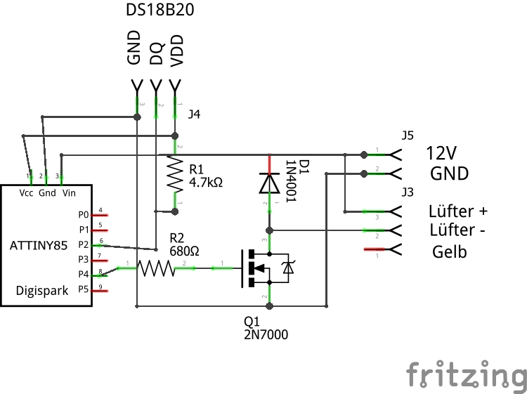
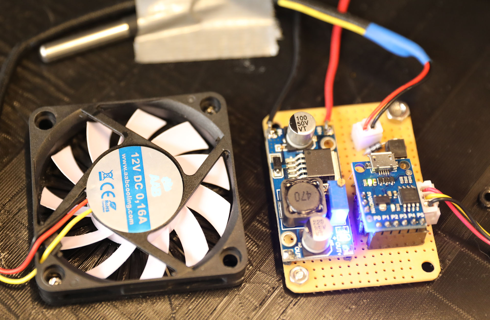

# ATTinnyLuefterSteuerung
3D Drucker Gehäuselüfter Steuerung mit ATTiny85

Der Gehäuselüfter in meinem SOVOL SV01 läuft normaler durchgehend. Auch das Tauschen des Original Lüfter brachte nur geringfügige Besserung. Um wenigstens, wenn nichts geduckt wir ruhe zu haben, entwickelte ich diese Schaltung.

Es wird ein mit ATTiny85 eingesetzt der die Temperatur mit einem DS18B20 misst. Sobald die Temperatur grösser als 25 Grad ist startet der Lüfter. Dabei läuft der Lüfter mit ~20% los. Bei steigender Temperatur wir die Geschwindigkeit des Lüfters erhöht. Bei einer Temperatur von 35% läuft der Lüfter bei 100%

Ich nutze ein Digispark Modul. Das ist leichter zu Programmieren und man spart den 5V Regler

Das fertige Modul mit Stepdown und Lüfter sieht dan so aus.

